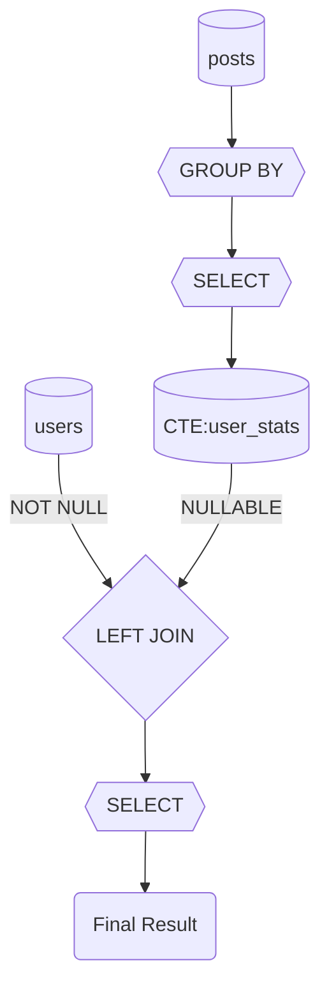

# rawsql-ts


🌐 [Online Demo (GitHub Pages)](https://mk3008.github.io/rawsql-ts/)

rawsql-ts is a high-performance SQL parser and AST transformer library written in TypeScript. It empowers you to represent raw SQL as objects, enabling flexible manipulation of SQL statements directly within your program. This object-oriented approach allows for partial transformation, decomposition into manageable components, and recombination as needed, dramatically improving the maintainability and reusability of complex SQL.

It is designed for extensibility and advanced SQL analysis, with initial focus on PostgreSQL syntax but not limited to it. The library enables easy SQL parsing, transformation, and analysis for a wide range of SQL dialects.

> [!Note]
> This library is currently in beta. The API may change until the v1.0 release.

---

## Key Features

- Zero dependencies: fully self-contained and lightweight
- High-speed SQL parsing and AST analysis (over 3x faster than major libraries)
- Rich utilities for SQL structure transformation and analysis
- Advanced SQL formatting capabilities, including multi-line formatting and customizable styles
- **Programmatic CTE Management** - Add, remove, and manipulate Common Table Expressions (CTEs) programmatically with support for PostgreSQL MATERIALIZED/NOT MATERIALIZED hints
- **JSON-to-TypeScript type transformation** - Automatically convert JSON-ified SQL results (dates as strings, BigInts) back to proper TypeScript types with configurable transformation rules
- **All-in-one dynamic query building with `DynamicQueryBuilder`** - combines filtering, sorting, pagination, and JSON serialization in a single, type-safe interface
- Dynamic SQL parameter injection for building flexible search queries with `SqlParamInjector` (supports like, ilike, in, any, range queries, OR/AND conditions and more)
- Dynamic ORDER BY clause injection with `SqlSortInjector` for flexible sorting with support for ASC/DESC, NULLS positioning, and append mode
- Dynamic LIMIT/OFFSET pagination injection with `SqlPaginationInjector` for efficient data pagination with page-based and offset-based support
- Type-safe schema management and JSON mapping conversion with full TypeScript support
- Static query validation and regression testing against your database schema with `SqlSchemaValidator`, enabling early error detection and robust unit tests for schema changes.

',borderColor:'rgba(54,162,235,1)',borderWidth:1},{label:'node-sql-parser',data:[0.210,0.223,0.420,0.871],backgroundColor:'rgba(255,206,86,0.8)',borderColor:'rgba(255,206,86,1)',borderWidth:1},{label:'sql-formatter',data:[0.228,0.547,1.057,1.906],backgroundColor:'rgba(255,99,132,0.8)',borderColor:'rgba(255,99,132,1)',borderWidth:1}]},options:{plugins:{legend:{labels:{color:'black'}}},scales:{x:{ticks:{color:'black'}},y:{ticks:{color:'black'}}},backgroundColor:'white'}}&width=700&height=450)

> [!Note]
> The "Mean" column represents the average time taken to process a query. Lower values indicate faster performance. For more details, see the [Benchmark](#benchmarks).

## Browser & CDN Ready

You can use rawsql-ts directly in modern browsers via CDN (unpkg/jsdelivr)!
No Node.js dependencies, no build tools required.
Just import it like this:

```html
<!-- Always get the latest version -->
<script type="module">
  import { parse } from "https://unpkg.com/rawsql-ts/dist/esm/index.min.js";
</script>
```

```html
<!-- Pin a specific version for stability -->
<script type="module">
  import { parse } from "https://unpkg.com/rawsql-ts@0.10.9-beta/dist/esm/index.min.js";
</script>
```

---

## Installation

```bash
npm install rawsql-ts
```

---

## Quick Start

Experience the power of rawsql-ts with `DynamicQueryBuilder` - build complex queries with filtering, sorting, pagination, and JSON serialization in one go!

```typescript
import { DynamicQueryBuilder, SqlFormatter } from 'rawsql-ts';

// Start with a simple base SQL
const baseSql = 'SELECT id, name, email, created_at FROM users WHERE active = true';

// Build a complete dynamic query with all features
const builder = new DynamicQueryBuilder();
const query = builder.buildQuery(baseSql, {
  // Dynamic filtering
  filter: { 
    status: 'premium', 
    created_at: { '>': '2024-01-01' } 
  },
  // Dynamic sorting
  sort: { 
    created_at: { desc: true }, 
    name: { asc: true } 
  },
  // Dynamic pagination
  paging: { 
    page: 2, 
    pageSize: 10 
  },
  // JSON serialization (optional)
  serialize: {
    rootName: 'user',
    rootEntity: { 
      id: 'user', 
      name: 'User', 
      columns: { id: 'id', name: 'name', email: 'email', createdAt: 'created_at' } 
    },
    nestedEntities: []
  }
});

// Format and execute
const formatter = new SqlFormatter();
const { formattedSql, params } = formatter.format(query);

console.log('Generated SQL:');
console.log(formattedSql);
// Output: Optimized PostgreSQL JSON query with filtering, sorting, and pagination

console.log('Parameters:');
console.log(params);
// Output: { status: 'premium', created_at_gt: '2024-01-01' }
```

---

## CTE Management API

The CTE Management API provides programmatic control over Common Table Expressions (CTEs), allowing you to build and manipulate WITH clauses dynamically. This is particularly useful for building complex analytical queries, data transformation pipelines, and hierarchical data structures.

```typescript
import { SelectQueryParser, SqlFormatter } from 'rawsql-ts';

// Build a multi-step data pipeline with CTEs
const pipeline = SelectQueryParser.parse('SELECT * FROM final_results').toSimpleQuery();

// Step 1: Add raw data CTE with PostgreSQL MATERIALIZED hint
const salesData = SelectQueryParser.parse(`
    SELECT customer_id, order_date, amount, product_category
    FROM sales WHERE order_date >= '2024-01-01'
`);
pipeline.addCTE('raw_sales', salesData.toSimpleQuery(), { materialized: true });

// Step 2: Add aggregation CTE
const monthlyStats = SelectQueryParser.parse(`
    SELECT customer_id, DATE_TRUNC('month', order_date) as month,
           SUM(amount) as total, COUNT(*) as orders
    FROM raw_sales
    GROUP BY customer_id, DATE_TRUNC('month', order_date)
`);
pipeline.addCTE('monthly_stats', monthlyStats.toSimpleQuery());

// Manage CTEs programmatically
console.log(pipeline.getCTENames()); // ['raw_sales', 'monthly_stats']
console.log(pipeline.hasCTE('raw_sales')); // true

// Replace the final query to use the CTEs
const finalQuery = SelectQueryParser.parse(`
    SELECT * FROM monthly_stats WHERE total > 10000
`);
pipeline.replaceCTE('final_results', finalQuery.toSimpleQuery());

// Format and execute
const formatter = new SqlFormatter();
const { formattedSql } = formatter.format(pipeline);
// Output: WITH "raw_sales" AS MATERIALIZED (...), "monthly_stats" AS (...) SELECT * FROM monthly_stats WHERE total > 10000
```

Key features include:
- **Dynamic CTE Management**: Add, remove, replace, and query CTEs programmatically
- **PostgreSQL MATERIALIZED Support**: Control query optimization with MATERIALIZED/NOT MATERIALIZED hints
- **Type Safety**: Full TypeScript support with error handling for duplicate names and invalid operations
- **Performance Optimized**: O(1) CTE name lookups for efficient operations

For comprehensive examples and advanced usage patterns, see the [CTE Management API Usage Guide](../../docs/usage-guides/cte-management-api-usage-guide.md).

---

## SelectQueryParser & Query Types

rawsql-ts provides robust parsers for `SELECT`, `INSERT`, and `UPDATE` statements, automatically handling SQL comments and providing detailed error messages. By converting SQL into a generic Abstract Syntax Tree (AST), it enables a wide variety of transformation processes.

### Query Type Overview

The parser returns different query types based on SQL structure:

- **`SimpleSelectQuery`**: Single SELECT statement with comprehensive manipulation API
- **`BinarySelectQuery`**: Combined queries using UNION, INTERSECT, EXCEPT operators
- **`ValuesQuery`**: VALUES clause queries for data insertion or testing
- **`SelectQuery`**: Base interface implemented by all SELECT query classes

```typescript
import { SelectQueryParser } from 'rawsql-ts';

// Returns SimpleSelectQuery
const simpleQuery = SelectQueryParser.parse('SELECT id, name FROM products WHERE category = \'electronics\'');

// Returns BinarySelectQuery  
const unionQuery = SelectQueryParser.parse('SELECT id, name FROM products UNION SELECT id, name FROM archived_products');

// Returns ValuesQuery
const valuesQuery = SelectQueryParser.parse('VALUES (1, \'Alice\'), (2, \'Bob\')');
```

### SimpleSelectQuery - Rich Programmatic API

`SimpleSelectQuery` provides extensive methods for programmatic query building and manipulation:

**Dynamic Condition Building:**
- `appendWhereExpr(columnName, exprBuilder)` - Add conditions by column name with upstream injection support
- `appendWhereRaw()`, `appendHavingRaw()` - Append raw SQL conditions
- `setParameter(name, value)` - Manage named parameters directly on the query object

**Query Composition:**
- `toUnion()`, `toIntersect()`, `toExcept()` - Combine with other queries
- `innerJoin()`, `leftJoin()`, `rightJoin()` - Add JOIN clauses programmatically
- `appendWith()` - Add Common Table Expressions (CTEs)

**Advanced Features:**
- Column-aware condition injection that resolves aliases and expressions
- Parameter management with validation and type safety
- Subquery wrapping with `toSource(alias)` for complex compositions

```typescript
import { SelectQueryParser } from 'rawsql-ts';

const query = SelectQueryParser.parse('SELECT id, salary * 1.1 AS adjusted_salary FROM employees');

// Add condition targeting the calculated column
query.appendWhereExpr('adjusted_salary', expr => `${expr} > 50000`);

// Set parameters directly on the query
query.setParameter('dept_id', 123);

// Add JOINs programmatically
query.leftJoinRaw('departments', 'd', 'department_id');

// Combine with another query
const adminQuery = SelectQueryParser.parse('SELECT id, salary FROM admins');
const combinedQuery = query.toUnion(adminQuery);
```

For comprehensive API documentation and advanced examples, see the [SimpleSelectQuery Usage Guide](../../docs/usage-guides/class-SimpleSelectQuery-usage-guide.md).

For SelectQueryParser details, see the [SelectQueryParser Usage Guide](../../docs/usage-guides/class-SelectQueryParser-usage-guide.md).

---

## SqlFormatter Features

The `SqlFormatter` class is the recommended way to format SQL queries, offering advanced capabilities like indentation, keyword casing, multi-line formatting, and comprehensive comment preservation.
It also allows for detailed style customization. For example, you can define your own formatting rules:

```typescript
import { SelectQueryParser, SqlFormatter } from 'rawsql-ts';

const customStyle = {
  identifierEscape: {
    start: "",
    end: ""
  },
  parameterSymbol: ":",
  parameterStyle: "named",
  indentSize: 4,
  indentChar: " ",
  newline: "\n",
  keywordCase: "lower",
  commaBreak: "before",
  andBreak: "before"
};

const sqlToFormat = `SELECT u.user_id, u.user_name FROM users as u WHERE status = :active ORDER BY created_at DESC;`;
const queryToFormat = SelectQueryParser.parse(sqlToFormat);
const customFormatter = new SqlFormatter(customStyle);
const { formattedSql: customFormattedSql } = customFormatter.format(queryToFormat);

console.log(customFormattedSql);
/*
select
    u.user_id
    , u.user_name
from
    users as u
where
    status = :active
order by
    created_at desc;
*/
```

### Comment Handling

SqlFormatter provides comprehensive comment parsing and export capabilities:

```typescript
import { SqlFormatter } from 'rawsql-ts';

// Enable comment export (disabled by default for backward compatibility)
const formatter = new SqlFormatter({ 
  exportComment: true,
  strictCommentPlacement: true  // Only export comments from clause-level keywords
});

const sqlWithComments = `
  -- This is a query to get active users
  SELECT 
    u.id, 
    u.name /* User's full name */
  FROM users u
  WHERE u.active = true -- Only active users
`;

const query = SelectQueryParser.parse(sqlWithComments);
const { formattedSql } = formatter.format(query);

console.log(formattedSql);
// Output includes comments preserved as block comments for SQL safety
```

**Comment Features:**
- **Full Comment Parsing**: Supports both `--` line comments and `/* */` block comments
- **AST Preservation**: Comments are stored in the Abstract Syntax Tree and preserved throughout transformations
- **Safe Export**: Line comments are automatically converted to block comments during export to prevent SQL structure issues
- **Configurable Export**: Enable/disable comment export with `exportComment` option
- **Comment Editing API**: Programmatically add, edit, delete, and search comments using the `CommentEditor` class
- **Clause Association**: Comments can be associated with specific SQL clauses and keywords

For more details, see the [SqlFormatter Usage Guide](../../docs/usage-guides/class-SqlFormatter-usage-guide.md).

---

## SqlParamInjector Features

The `SqlParamInjector` class revolutionizes how you build dynamic search queries. Instead of manually constructing different SQL statements for various search conditions, you simply provide a fixed base SQL and a state object. `SqlParamInjector` then dynamically injects parameters and automatically generates the optimal WHERE conditions.

Key benefits include:
- **Simplified Query Management**: Prepare a single base SQL; `SqlParamInjector` handles the variations.
- **Effortless Optimal Queries**: Just pass a state object, and it generates a highly efficient query.
- **Performance-Oriented**: Conditions are intelligently inserted as close to the data source as possible, significantly improving query performance by filtering data early.
- **Zero Conditional Logic in Code**: Forget writing complex IF statements in your application code to handle different filters.
- **Enhanced SQL Reusability**: Your base SQL remains clean and can be reused across different scenarios with varying search criteria.
- **Rich Operator Support**: Supports various SQL operators including equality, comparison, range (min/max), pattern matching (like/ilike), IN clauses, and PostgreSQL array operators.
- **Advanced Condition Logic**: Supports OR/AND conditions, automatic parentheses grouping, and explicit column mapping for flexible query construction.

```typescript
import { SqlParamInjector, SqlFormatter } from 'rawsql-ts';

const sql = `SELECT u.user_id, u.user_name FROM users as u WHERE u.active = TRUE`;
const injector = new SqlParamInjector();
// Inject parameters and generate WHERE conditions
const injectedQuery = injector.inject(sql, { user_id: 42, user_name: 'Alice' });

const formatter = new SqlFormatter();
const { formattedSql, params } = formatter.format(injectedQuery);

console.log(formattedSql);
// Output: select "u"."user_id", "u"."user_name" from "users" as "u" where "u"."active" = true and "u"."user_id" = :user_id and "u"."user_name" = :user_name
console.log(params);
// Output: { user_id: 42, user_name: 'Alice' }
```

For more details, see the [SqlParamInjector Usage Guide](../../docs/usage-guides/class-SqlParamInjector-usage-guide.md).

---

## SqlSortInjector Features

The `SqlSortInjector` class enables dynamic ORDER BY clause injection into SQL queries, providing a clean and flexible way to handle sorting requirements. Instead of manually constructing different SQL statements for various sorting scenarios, you can inject sort conditions into your base SQL query, making your code more maintainable and reusable.

Key benefits include:
- **Dynamic Sort Injection**: Add ORDER BY conditions to existing queries without modifying the base SQL
- **Flexible Sort Options**: Support for ASC/DESC directions with NULLS FIRST/LAST positioning
- **Append Mode**: Preserves existing ORDER BY clauses and appends new conditions
- **Column Alias Support**: Works seamlessly with column aliases and calculated expressions
- **TableColumnResolver Integration**: Supports wildcard SELECT queries through schema resolution
- **Clean Separation**: Remove existing ORDER BY clauses when needed with `removeOrderBy()`

```typescript
import { SqlSortInjector, SqlFormatter } from 'rawsql-ts';

// Basic sort injection
const baseSql = 'SELECT id, name, created_at FROM users WHERE active = true';
const sortConditions = {
  created_at: { desc: true, nullsLast: true },
  name: { asc: true }
};

const injector = new SqlSortInjector();
const sortedQuery = injector.inject(baseSql, sortConditions);

const formatter = new SqlFormatter();
const { formattedSql } = formatter.format(sortedQuery);

console.log(formattedSql);
// Output: select "id", "name", "created_at" from "users" where "active" = true order by "created_at" desc nulls last, "name"

// Append to existing ORDER BY
const existingSql = 'SELECT id, name FROM users ORDER BY id ASC';
const additionalSort = { name: { desc: true } };
const appendedQuery = injector.inject(existingSql, additionalSort);
// Result: SELECT id, name FROM users ORDER BY id ASC, name DESC

// Remove existing ORDER BY when needed
const cleanQuery = SqlSortInjector.removeOrderBy(existingSql);
const newSortedQuery = injector.inject(cleanQuery, { name: { desc: true } });
// Result: SELECT id, name FROM users ORDER BY name DESC
```

For more details, see the [SqlSortInjector Usage Guide](../../docs/usage-guides/class-SqlSortInjector-usage-guide.md).

---

## SqlPaginationInjector Features

The `SqlPaginationInjector` class enables dynamic LIMIT/OFFSET clause injection into SQL queries, providing a clean and efficient way to handle data pagination. Instead of manually constructing different SQL statements for various page sizes and offsets, you can inject pagination into your base SQL query, making your code more maintainable and performance-optimized.

Key benefits include:
- **Page-Based Pagination**: Simple page number and page size configuration with automatic offset calculation
- **Automatic OFFSET Optimization**: Smart handling where page 1 omits unnecessary OFFSET 0 clauses
- **Existing Clause Detection**: Prevents conflicts by detecting and reporting existing LIMIT/OFFSET clauses
- **Validation & Safety**: Built-in validation for page numbers, page sizes, and configurable maximum limits
- **Clean Removal**: Remove existing pagination clauses when needed with `removePagination()`
- **Performance Conscious**: Generates standard LIMIT/OFFSET patterns optimized for database engines

```typescript
import { SqlPaginationInjector, SqlFormatter } from 'rawsql-ts';

// Basic pagination injection
const baseSql = 'SELECT id, name, email FROM users WHERE active = true ORDER BY created_at DESC';
const pagination = {
  page: 2,        // Page number (1-based)
  pageSize: 20    // Items per page
};

const injector = new SqlPaginationInjector();
const paginatedQuery = injector.inject(baseSql, pagination);

const formatter = new SqlFormatter();
const { formattedSql } = formatter.format(paginatedQuery);

console.log(formattedSql);
// Output: select "id", "name", "email" from "users" where "active" = true order by "created_at" desc limit 20 offset 20

// First page optimization (no OFFSET needed)
const firstPagePagination = { page: 1, pageSize: 10 };
const firstPageQuery = injector.inject(baseSql, firstPagePagination);
const { formattedSql: firstPageSql } = formatter.format(firstPageQuery);
console.log(firstPageSql);
// Output: select "id", "name", "email" from "users" where "active" = true order by "created_at" desc limit 10

// Remove existing pagination when needed
const existingPaginatedSql = 'SELECT id, name FROM users LIMIT 50 OFFSET 100';
const cleanQuery = SqlPaginationInjector.removePagination(existingPaginatedSql);
const newPagination = { page: 1, pageSize: 25 };
const repaginatedQuery = injector.inject(cleanQuery, newPagination);
// Result: Clean query with new pagination applied

// Combine with other injectors for complete query building
let query = new SqlParamInjector().inject(baseSql, { status: 'active' });
query = new SqlSortInjector().inject(query, { created_at: { desc: true } });
query = new SqlPaginationInjector().inject(query, { page: 3, pageSize: 15 });
// Result: Filtered, sorted, and paginated query ready for execution
```

For more details, see the [SqlPaginationInjector Usage Guide](../../docs/usage-guides/class-SqlPaginationInjector-usage-guide.md).

---

## DynamicQueryBuilder Features

The `DynamicQueryBuilder` class is a powerful, all-in-one solution that combines SQL parsing with dynamic condition injection (filtering, sorting, pagination, and JSON serialization). It provides a unified interface for building complex queries without the need to manually chain multiple injectors, making it ideal for modern web applications that require flexible, dynamic query generation.

Key benefits include:
- **Unified Interface**: Single class that combines filtering, sorting, pagination, and JSON serialization
- **Framework-Agnostic**: Pure JavaScript/TypeScript with no file system dependencies
- **Composable Architecture**: Internally uses specialized injectors in optimal order for performance
- **Type-Safe**: Full TypeScript support with strongly typed options and return values
- **Performance Optimized**: Applies conditions in the most efficient order (filter → sort → paginate → serialize)
- **Easy Testing**: No external dependencies make unit testing straightforward

```typescript
import { DynamicQueryBuilder, SqlFormatter } from 'rawsql-ts';

// Create a builder instance
const builder = new DynamicQueryBuilder();

// Build a complete dynamic query with all features
const baseQuery = 'SELECT id, name, email, created_at FROM users WHERE active = true';
const options = {
  filter: { 
    status: 'premium',
    created_at: { min: '2024-01-01' }  // Range filter
  },
  sort: { 
    created_at: { desc: true, nullsLast: true },
    name: { asc: true }
  },
  paging: { page: 2, pageSize: 20 },
  serialize: {
    rootName: 'users',
    rootEntity: {
      id: 'user',
      name: 'User',
      columns: { id: 'id', name: 'name', email: 'email', created: 'created_at' }
    },
    nestedEntities: []
  }
};

const dynamicQuery = builder.buildQuery(baseQuery, options);

const formatter = new SqlFormatter();
const { formattedSql, params } = formatter.format(dynamicQuery);

console.log(formattedSql);
// Output: Complex JSON query with all conditions applied
console.log(params);
// Output: { status: 'premium', created_at_min: '2024-01-01', paging_limit: 20, paging_offset: 20 }

// Convenience methods for specific use cases
const filteredOnly = builder.buildFilteredQuery(baseQuery, { name: 'Alice' });
const sortedOnly = builder.buildSortedQuery(baseQuery, { created_at: { desc: true } });
const paginatedOnly = builder.buildPaginatedQuery(baseQuery, { page: 1, pageSize: 10 });

// Validate SQL without applying modifications
const isValid = builder.validateSql('SELECT id FROM users');
console.log(isValid); // true
```

For more details, see the [DynamicQueryBuilder Usage Guide](../../docs/usage-guides/class-DynamicQueryBuilder-usage-guide.md).

---

## Query Flow Diagram Generation

Generate Mermaid flow diagrams from SQL queries to visualize data flow and query execution order.

```typescript
import { QueryFlowDiagramGenerator } from 'rawsql-ts';

const sql = `
  WITH user_stats AS (
    SELECT user_id, COUNT(*) as post_count
    FROM posts GROUP BY user_id
  )
  SELECT u.name, us.post_count
  FROM users u
  LEFT JOIN user_stats us ON u.id = us.user_id
`;

const mermaid = QueryFlowDiagramGenerator.generate(sql);
console.log(mermaid);
// Output: Mermaid flowchart showing data flow through SQL operations
```

### Symbol Reference

| SQL Element | Shape | Example |
|-------------|-------|---------|
| Table/CTE/Subquery | Cylinder | `table_users[(users)]`, `cte_stats[(CTE:user_stats)]` |
| SELECT/WHERE/GROUP BY | Hexagon | `{{SELECT}}`, `{{WHERE}}` |
| JOIN/UNION | Diamond | `{LEFT JOIN}`, `{UNION ALL}` |

Example output for CTE query:


---

## PostgresJsonQueryBuilder Features

The `PostgresJsonQueryBuilder` class transforms relational SQL queries into PostgreSQL JSON queries that return hierarchical JSON structures. It automatically handles complex relationships between entities and generates optimized Common Table Expressions (CTEs) for efficient JSON aggregation, making it perfect for building APIs, reports, and data exports.

Key benefits include:
- **Hierarchical JSON Generation**: Transforms flat relational data into nested JSON objects and arrays
- **Automatic CTE Management**: Generates optimized CTEs with proper dependency ordering
- **Flexible Relationship Types**: Supports both object (0..1) and array (1..N) relationships
- **NULL Handling**: Properly represents missing relationships as NULL instead of empty objects
- **Performance Optimized**: Uses depth-based processing and JSONB for optimal PostgreSQL performance
- **Zero Manual Serialization**: Eliminates the need for manual object mapping and JSON construction

```typescript
import { SelectQueryParser, PostgresJsonQueryBuilder } from 'rawsql-ts';

// Parse your base SQL query
const baseQuery = SelectQueryParser.parse(`
    SELECT o.order_id, o.order_date, c.customer_name, i.product_name, i.quantity
    FROM orders o
    LEFT JOIN customers c ON o.customer_id = c.customer_id  
    LEFT JOIN order_items i ON o.order_id = i.order_id
`) as SimpleSelectQuery;

// Define JSON mapping configuration
const mapping = {
    rootName: "order",
    rootEntity: { id: "order", name: "Order", columns: { "id": "order_id", "date": "order_date" }},
    nestedEntities: [
        { id: "customer", parentId: "order", propertyName: "customer", relationshipType: "object", 
          columns: { "name": "customer_name" }},
        { id: "items", parentId: "order", propertyName: "items", relationshipType: "array",
          columns: { "product": "product_name", "qty": "quantity" }}    ]
};

// Transform to JSON query
const builder = new PostgresJsonQueryBuilder();
const jsonQuery = builder.buildJson(baseQuery, mapping);
// Returns optimized PostgreSQL query with CTEs that produces:
// [{ "id": 1, "date": "2024-01-15", "customer": {"name": "John"}, "items": [{"product": "Widget", "qty": 2}] }]
```

For more details, see the [PostgresJsonQueryBuilder Usage Guide](../../docs/usage-guides/class-PostgresJsonQueryBuilder-usage-guide.md).

---

## SqlSchemaValidator Features

The `SqlSchemaValidator` class helps ensure your SQL queries are valid against a predefined database schema. It can extract schema information about the physical tables your SQL query depends on. By comparing this extracted information with your defined schema (e.g., a schema definition class), you can statically verify the query's behavior. This enables you to perform regression testing as part of your unit tests when schema definitions change, ensuring that your queries remain compatible.

It checks if the tables and columns referenced in your query actually exist in your schema, and it understands table aliases. If there's a problem, it gives you a clear error message telling you what's wrong and where.

Key benefits include:
- **Schema Validation**: Verifies SQL queries against your database schema.
- **Table and Column Verification**: Confirms the existence of tables and columns used in the query.
- **Alias Aware**: Correctly resolves table aliases.
- **Clear Error Reporting**: Provides descriptive error messages for easy debugging.
- **Static Analysis**: Allows comparison of SQL-derived schema information with predefined schema definitions.
- **Automated Regression Testing**: Facilitates unit testing for schema change impacts on queries.

```typescript
import { SelectQueryParser, SqlSchemaValidator } from 'rawsql-ts';

// Define your database schema
const schema = {
  users: ['user_id', 'user_name', 'email', 'status'],
  orders: ['order_id', 'user_id', 'order_date', 'total_amount']
};

const validator = new SqlSchemaValidator(schema);

// Example: Validate a SELECT query
const validSql = 'SELECT u.user_id, u.user_name FROM users as u WHERE u.status = \'active\'';
const queryToValidate = SelectQueryParser.parse(validSql);

try {
  validator.validate(queryToValidate);
  console.log('Query is valid against the schema.');
} catch (error) {
  console.error('Schema validation failed:', error.message);
}

// Example: Validate a query with a non-existent column
const invalidSql = 'SELECT user_id, non_existent_column FROM users';
const invalidQuery = SelectQueryParser.parse(invalidSql);

try {
  validator.validate(invalidQuery);
} catch (error) {
  console.error('Schema validation error for non-existent column:', error.message);
  // Expected output: Validation failed: Column 'non_existent_column' not found in table 'users'.
}
```

For more details on `SqlSchemaValidator`, see the [SqlSchemaValidator Usage Guide](../../docs/usage-guides/class-SqlSchemaValidator-usage-guide.md).

---

## QueryBuilder Features

`QueryBuilder` is a powerful utility that enhances the management and generation of SQL modification queries (such as `INSERT` or `UPDATE`) by leveraging select queries. This approach significantly improves the maintainability of complex data manipulation logic. It allows for the conversion of select queries into corresponding update-type queries, streamlining development and ensuring consistency.

```typescript
import { SelectQueryParser, QueryBuilder, SqlFormatter, QueryNormalizer } from 'rawsql-ts';

// Example: Convert a SELECT query to an UPDATE query
const selectSourceSql = 'SELECT id, new_email AS email, last_login FROM user_updates_source WHERE needs_update = TRUE';
// QueryBuilder.buildUpdateQuery expects a SimpleSelectQuery as input.
// If your source is a complex query (e.g. with UNIONs or CTEs), normalize it first.
const normalizedSelectQuery = QueryNormalizer.normalize(SelectQueryParser.parse(selectSourceSql));

// Define the target table for the UPDATE and the primary key(s) for joining
const targetTable = 'users';
const primaryKeys = ['id']; // Column(s) to match records between source and target

const updateQuery = QueryBuilder.buildUpdateQuery(
  normalizedSelectQuery,
  'd', // Alias of the source query in the FROM clause
  targetTable,
  primaryKeys
);

const formatter = new SqlFormatter({ preset: 'postgres' }); // Using postgres preset for clarity
const { formattedSql: updateSql } = formatter.format(updateQuery);

console.log(updateSql);
// Example output (actual output depends on the SQL dialect and specific query structure):
// update "users" set "email" = "d"."email", "last_login" = "d"."last_login" from (SELECT id, new_email AS email, last_login FROM user_updates_source WHERE needs_update = TRUE) as "d" where "users"."id" = "d"."id"
```

For more details on `QueryBuilder`, see the [QueryBuilder Usage Guide](../../docs/usage-guides/class-QueryBuilder-usage-guide.md).

---

## SchemaManager Features

The `SchemaManager` class provides unified schema definition and type-safe conversion to various formats, eliminating code duplication for rawsql-ts. It serves as a central hub for managing database schema definitions and converting them to formats required by different components like `SqlParamInjector` and `PostgresJsonQueryBuilder`.

Key benefits include:
- **Unified Schema Definition**: Define your database schema once and generate JSON mappings, table column resolvers, and other formats for multiple rawsql-ts components
- **Type-Safe JSON Mapping**: Fully typed conversion without using `any` types
- **Schema Validation**: Built-in validation ensures schema consistency and integrity
- **Relationship Management**: Supports complex table relationships with object and array outputs

```typescript
import { SchemaManager, createSchemaManager } from 'rawsql-ts';

// Define your database schema once
const schemas = {
  users: {
    name: 'users',
    columns: {
      user_id: { name: 'user_id', isPrimaryKey: true },
      user_name: { name: 'user_name' },
      email: { name: 'email' }
    }
  }
};

// Create SchemaManager and use with other components
const schemaManager = createSchemaManager(schemas);
const tableColumnResolver = schemaManager.createTableColumnResolver();
const injector = new SqlParamInjector({ tableColumnResolver });
```

For more details on `SchemaManager`, see the [SchemaManager Usage Guide](../../docs/usage-guides/class-SchemaManager-usage-guide.md).

---

## Benchmarks

This project includes a comprehensive benchmark suite to evaluate the performance of `rawsql-ts` in comparison with other popular libraries such as `node-sql-parser` and `sql-formatter`.

### How to Run

```bash
npm run benchmark
```

### Benchmark Details

The benchmark suite measures SQL parsing and formatting speed across queries of varying complexity:

- **Tokens20**: Simple SELECT with a basic WHERE clause (~20 tokens)
- **Tokens70**: Medium complexity query with JOINs and multiple conditions (~70 tokens)
- **Tokens140**: Complex query with CTEs and aggregations (~140 tokens)
- **Tokens230**: Highly complex query with multiple CTEs, subqueries, and window functions (~230 tokens)

### Benchmark Environment

```
benchmark.js v2.1.4  
Windows 10.0.26100  
AMD Ryzen 7 7800X3D (8C/16T)  
Node.js v22.14.0
```

### Results

#### Tokens20
| Method                            | Mean (ms)  | Error (ms) | StdDev (ms) | Times slower vs rawsql-ts |
|---------------------------------- |-----------:|----------:|----------:|--------------------------:|
| rawsql-ts                      |    0.029 |  0.0087 |  0.0044 |                - |
| node-sql-parser                |    0.210 |  0.4505 |  0.2298 |             7.3x |
| sql-formatter                  |    0.228 |  0.1598 |  0.0815 |             8.0x |

> [!Note] When the token count is extremely low, `rawsql-ts` becomes disproportionately fast. However, such small queries are rare in real-world scenarios, so this result is excluded from the overall performance summary.

#### Tokens70
| Method                            | Mean (ms)  | Error (ms) | StdDev (ms) | Times slower vs rawsql-ts |
|---------------------------------- |-----------:|----------:|----------:|--------------------------:|
| rawsql-ts                      |    0.075 |  0.0541 |  0.0276 |                - |
| node-sql-parser                |    0.223 |  0.0848 |  0.0432 |             3.0x |
| sql-formatter                  |    0.547 |  0.1432 |  0.0731 |             7.3x |

#### Tokens140
| Method                            | Mean (ms)  | Error (ms) | StdDev (ms) | Times slower vs rawsql-ts |
|---------------------------------- |-----------:|----------:|----------:|--------------------------:|
| rawsql-ts                      |    0.137 |  0.0175 |  0.0089 |                - |
| node-sql-parser                |    0.420 |  0.1030 |  0.0526 |             3.1x |
| sql-formatter                  |    1.057 |  0.2390 |  0.1220 |             7.7x |

#### Tokens230
| Method                            | Mean (ms)  | Error (ms) | StdDev (ms) | Times slower vs rawsql-ts |
|---------------------------------- |-----------:|----------:|----------:|--------------------------:|
| rawsql-ts                      |    0.239 |  0.0577 |  0.0294 |                - |
| node-sql-parser                |    0.871 |  0.2042 |  0.1042 |             3.6x |
| sql-formatter                  |    1.906 |  1.4631 |  0.7465 |             8.0x |

### Performance Summary

- `rawsql-ts` remains one of the fastest parsers, though it is approximately 10% slower in version 0.7 compared to previous versions. This is due to the addition of enhanced parameterized query parsing and SQL formatting capabilities.
- About 3–4x faster than `node-sql-parser`.
- About 4–5x faster than `sql-parser-cst`.
- About 7–8x faster than `sql-formatter`.
- Maintains high performance even for complex SQL, while providing comprehensive features.

> **Note:** These benchmarks are based on a specific hardware and software environment. Actual performance may vary depending on system configuration and query complexity.

---

Feel free to try rawsql-ts! Questions, requests, and bug reports are always welcome.
