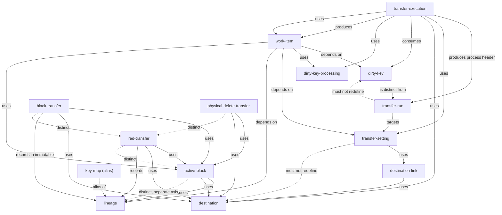

# Transfer Concept Map

## Purpose

この文書は、`@rawsql-ts/transfer` の Concept Spec 同士の相関を整理する。

個別 Concept の定義、責務、非責務、不変条件は各 Concept Spec に置く。
この文書では、概念同士の関係、定義予定の概念、未定義概念の候補だけを扱う。

この文書は人間レビュー用の草案であり、個別 Concept Spec の意味を再定義しない。

## Layout Policy

Concept Specs are intentionally kept flat under this directory.

The transfer domain concepts form a graph, not a filesystem tree.
Do not move Concept Specs into nested folders to express dependency, execution order, transfer model, or ownership.

Use this map and `concept-relationship.json` to express structure, relationships, lifecycle order, and multiple conceptual views.

## Defined Concepts

| Concept ID | Spec | Summary |
|---|---|---|
| dirty-key | [dirty-key/SPEC.md](./dirty-key/SPEC.md) | 変更が起きた可能性のある発生元行を識別する変更検知履歴 |
| dirty-key-processing | [dirty-key-processing/SPEC.md](./dirty-key-processing/SPEC.md) | Dirty Key がどの Transfer Run と転送先設定で処理され、どの結果になったかを記録する概念 |
| destination | [destination/SPEC.md](./destination/SPEC.md) | 転送先テーブルへ書き込むために必要な転送先側の仕様 |
| lineage | [lineage/SPEC.md](./lineage/SPEC.md) | 転送先行の転送元を特定し、元ネタを追跡する概念 |
| transfer-execution | [transfer-execution/SPEC.md](./transfer-execution/SPEC.md) | Transfer Run をプロセスヘッダーとして生成し、Work Item に整理された情報をもとに転送表現を選ぶメインルーチン |
| transfer-setting | [transfer-setting/SPEC.md](./transfer-setting/SPEC.md) | 転送元データソースを定義し、Destination への接続を管理する設定 |
| destination-link | [destination-link/SPEC.md](./destination-link/SPEC.md) | Transfer Setting のデータソースを特定 Destination へ接続する宛先別設定 |
| transfer-run | [transfer-run/SPEC.md](./transfer-run/SPEC.md) | Transfer Execution が生成する実行引数記録兼プロセスヘッダー |
| work-item | [work-item/SPEC.md](./work-item/SPEC.md) | Dirty Key を Transfer Setting の文脈で固定化し、転送判断を付与した作業対象 |
| active-black | [active-black/SPEC.md](./active-black/SPEC.md) | 転送済みの黒伝のうち、まだ取り消されていない現在有効な黒伝 |
| black-transfer | [black-transfer/SPEC.md](./black-transfer/SPEC.md) | 転送元の現在値を転送先へコピーし、黒伝を作る通常転送 |
| physical-delete-transfer | [physical-delete-transfer/SPEC.md](./physical-delete-transfer/SPEC.md) | mutable transfer model で既存の転送先行を物理削除する削除表現 |
| red-transfer | [red-transfer/SPEC.md](./red-transfer/SPEC.md) | immutable transfer model で黒伝を反転した赤伝を追加する取消または訂正表現 |

## Planned or Candidate Concepts

| Concept ID | Current Status | Summary | Note |
|---|---|---|---|
| key-map | alias | lineage の説明用語。 | キー変換で lineage 管理を説明するための別名として扱い、Concept Spec 候補からは格下げする。 |
| duplicate-control | candidate | 重複制御。 | Dirty Key では管理しない概念として登場するが、独立 Concept にするか未定。 |
| black-insert-transfer | variant | Black Transfer のうち、新しい黒伝を追加する転送表現。 | `black-transfer/SPEC.md` 内で扱う。 |
| black-update-transfer | variant | Black Transfer のうち、mutable transfer model で既存の黒伝を直接 UPDATE する転送表現。 | `black-transfer/SPEC.md` 内で扱う。 |

## Defined Concept Relationships

| From | Kind | To | Note |
|---|---|---|---|
| transfer-run | targets | transfer-setting | Transfer Run は必ず1つの Transfer Setting を対象にする。 |
| transfer-run | must-not-redefine | transfer-setting | Transfer Run は Transfer Setting の内容を再定義しない。 |
| transfer-run | must-not-redefine | dirty-key | Transfer Run は Dirty Key の意味を再定義しない。 |
| transfer-setting | uses | destination | Transfer Setting は Destination Link を通じて Destination へ接続される。 |
| transfer-setting | uses | destination-link | Transfer Setting は Destination への接続を Destination Link として管理する。 |
| transfer-setting | must-not-redefine | destination | Transfer Setting は Destination の意味を再定義しない。 |
| transfer-setting | must-not-redefine | dirty-key | Transfer Setting は Dirty Key の意味を再定義しない。 |
| destination-link | depends-on | transfer-setting | Destination Link は必ず1つの Transfer Setting に属する。 |
| destination-link | uses | destination | Destination Link は必ず1つの Destination を参照する。 |
| destination-link | must-not-redefine | destination | Destination Link の mapping は Destination の物理仕様を再定義しない。 |
| destination | is-distinct-from | transfer-setting | Destination は Transfer Setting から独立した転送先仕様である。 |
| destination | must-not-redefine | transfer-setting | Destination は Transfer Setting の都合で転送先仕様の意味を変えない。 |
| dirty-key | is-distinct-from | transfer-run | Dirty Key は転送指示、転送状態、転送結果ではない。 |
| lineage | records | transfer-run | Lineage はどの Transfer Run による転送かを追跡する。 |
| lineage | records | transfer-setting | Lineage はどの Transfer Setting に基づく転送先行かを追跡する。 |
| lineage | records | destination | Lineage はどの Destination の転送先行へ転送されたかを追跡する。 |
| active-black | uses | lineage | Active Black は、immutable transfer model で現在有効な黒伝を追跡するときに Lineage と併用されることがある。 |
| active-black | is-distinct-from | lineage | Lineage は転送先行の由来追跡であり、Active Black は現在有効な黒伝を示す別軸の概念。 |
| active-black | uses | destination | Active Black は転送先に存在する黒伝を参照する。 |
| black-transfer | uses | active-black | Black Transfer は二重転送判断と成功後の現在有効な黒伝として Active Black を参照する。 |
| black-transfer | uses | destination | Black Transfer は転送先へ黒伝を作る。 |
| black-transfer | records | lineage | immutable transfer model の Black Transfer は転送元データソースの論理行と黒伝の対応を Lineage として記録する。 |
| black-transfer | is-distinct-from | red-transfer | Black Transfer は現在値を転送先へコピーし、Red Transfer は既存黒伝を反転した赤伝を追加する。 |
| black-insert-transfer | variant-of | black-transfer | Black Insert Transfer は Black Transfer のうち、新しい黒伝を追加する転送表現。 |
| black-update-transfer | variant-of | black-transfer | Black Update Transfer は Black Transfer のうち、mutable transfer model で既存の黒伝を直接 UPDATE する転送表現。 |
| physical-delete-transfer | uses | active-black | Physical Delete Transfer は削除対象となる Active Black を必要とする。 |
| physical-delete-transfer | uses | destination | Physical Delete Transfer は Destination 上の既存転送先行を物理削除する。 |
| physical-delete-transfer | is-distinct-from | red-transfer | mutable の削除相当は Physical Delete Transfer、immutable の削除相当は Red Transfer として扱う。 |
| red-transfer | uses | active-black | Red Transfer は反転対象となる Active Black を必要とする。 |
| red-transfer | uses | destination | Red Transfer は Destination の transfer model と赤伝列情報に基づく。 |
| red-transfer | records | lineage | Red Transfer は反転対象だった既存の転送先行と生成された赤伝の対応を Lineage として記録する。 |
| red-transfer | is-distinct-from | active-black | Red Transfer は赤伝を追加する取消または訂正表現であり、Active Black はその反転対象となる現在有効な黒伝である。 |
| transfer-execution | produces | transfer-run | Transfer Execution は Transfer Run を実行引数記録兼プロセスヘッダーとして生成する。 |
| transfer-execution | uses | transfer-setting | Transfer Execution は対象 Transfer Setting に従って転送する。 |
| transfer-execution | uses | destination | Transfer Execution は Destination の transfer model と転送先仕様を参照する。 |
| transfer-execution | consumes | dirty-key | Transfer Execution は Dirty Key Management に蓄積された変更通知を転送対象候補として扱う。 |
| transfer-execution | uses | dirty-key-processing | Transfer Execution は Work Item 作成時に処理済み Dirty Key を除外し、処理後に Dirty Key Processing を記録する。 |
| transfer-execution | produces | work-item | Transfer Execution は Dirty Key を Work Item として固定化する。 |
| transfer-execution | uses | work-item | Transfer Execution は Work Item に整理された情報をもとに転送表現を選ぶ。 |
| transfer-execution | uses | active-black | Transfer Execution は Active Black の有無を転送判断に使う。 |
| transfer-execution | uses | black-transfer | Transfer Execution は必要に応じて Black Transfer を行う。 |
| transfer-execution | uses | red-transfer | Transfer Execution は immutable transfer model で必要に応じて Red Transfer を行う。 |
| transfer-execution | uses | physical-delete-transfer | Transfer Execution は mutable transfer model で必要に応じて Physical Delete Transfer を行う。 |
| work-item | depends-on | dirty-key | Work Item は Dirty Key を固定化して作られる。 |
| work-item | uses | dirty-key-processing | Work Item は Dirty Key Processing に記録済みの Dirty Key を処理済みとして除外する。 |
| work-item | depends-on | transfer-setting | Work Item は Transfer Setting の文脈で判断される。 |
| work-item | uses | active-black | Work Item は Active Black の有無を転送判断の材料として扱う。 |
| work-item | uses | destination | Work Item は Destination の transfer model を転送判断の材料として扱う。 |
| work-item | is-distinct-from | dirty-key | Dirty Key は変更検知履歴であり、Work Item は処理対象として固定化され転送判断を持つ。 |
| dirty-key-processing | depends-on | dirty-key | Dirty Key Processing は処理済み Dirty Key ID を記録する。 |
| dirty-key-processing | records | transfer-run | Dirty Key Processing はどの Transfer Run で処理されたかを記録する。 |
| dirty-key-processing | depends-on | transfer-setting | Dirty Key Processing は Transfer Setting の文脈を持つ。 |
| dirty-key-processing | depends-on | destination-link | Dirty Key Processing は転送先設定 ID を持ち、Destination Link の文脈を区別する。 |
| dirty-key-processing | is-distinct-from | dirty-key | Dirty Key は変更検知履歴であり、Dirty Key Processing は処理済み記録である。 |
| key-map | alias-of | lineage | Key Map は lineage の別名または説明用語として扱う。 |

## Candidate Concept Relationships

| From | Kind | To | Note |
|---|---|---|---|
| work-item | depends-on | lineage | Work Item は既存 lineage に基づく重複、再転送、削除相当判定に影響される可能性がある。 |

`alias-of` は今回追加した relationship kind 候補である。Concept Spec 候補から格下げした用語を機械可読に残すために使う。

## Active Black Example

Active Black は、Red Transfer する場合にどの黒伝を符号反転対象にするかを示す。

```text
black 1: +100
```

この場合、`1` が active。

```text
black 1: +100
red 2: -100
```

この場合、active はない。

```text
black 1: +100
red 2: -100
black 3: +150
```

この場合、`3` が active。

この例は概念相関の説明であり、Active Black の Concept Spec 本文ではない。

## Diagram



## Open Questions

- Transfer Run の lifecycle state と Transfer Execution の実行試行状態をどう分けるか。
- `produces` を Transfer Execution から Transfer Run への関係種別として正式採用するか。
- Work Item と Transfer Execution の責務境界は十分か。Work Item の固定化処理を Transfer Execution 内部に留めるか、独立 feature とするか。
- `alias-of` を relationship kind として正式採用するか。
- relationship kind は現在の候補で十分か。特に `uses`、`depends-on`、`consumes`、`produces`、`records` の使い分けを CLI 検査向けに固定する必要があるか。
- 編集時バリデーションとして、転送元データソース、Destination、Destination Link、生成済み SQL、Active Black、Lineage に関わる変更のうち、どれを warning とし、どれを block とするかを整理する必要がある。

## Review Request

人間レビューでは、以下を確認する。

- Concept 一覧に漏れがないか。
- `alias`、`candidate` の status が妥当か。
- 未定義 Concept の候補が妥当か。
- relationship kind が妥当か。
- 個別 Concept Spec の意味を再定義していないか。
- `concept-map.md` と `concept-relationship.json` が矛盾していないか。
