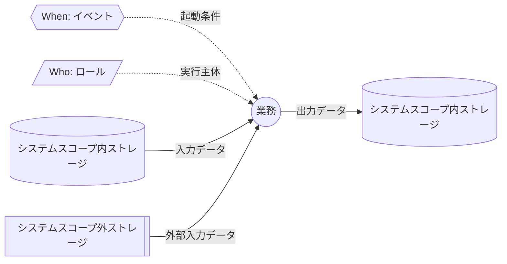

# Transfer Data Flow Diagrams

This directory contains Data Flow Diagrams for `@rawsql-ts/transfer`.

DFDs describe where data comes from, which process receives or produces it, and which concept or store is affected.
They complement Concept Specs and Process Maps:

- Concept Specs define stable meanings and invariants.
- Process Maps define process order and process-level input/output.
- DFDs define data movement across system boundaries, processes, and stores.

DFDs are logical design documents.
They do not define SQL, DDL, API shape, transaction implementation, or physical storage layout.

## DFD Structure

DFDs use two levels, following the same separation as process maps:

- Overall flow: shows the relationship between business operations.
- Detail flow: explains one business operation with `When`, `Who`, input storage/data, and output storage/data.

Overall flow should not explain the inside of each business operation.
Detail flow should not duplicate the full routine.

DFDs may use DFD Concept Groups when concrete Concept lists would make the flow too noisy.
DFD Concept Groups are virtual display labels for DFD readability.
They exist only in `relationship.json`; their concrete members must be derived from that metadata.
They are not standalone runtime concepts and must not redefine ordinary Concept Specs.

Process Maps must not use DFD Concept Groups.
Process Maps should use concrete Concepts in detail diagrams because they explain process-level input/output.

DFD term relationships and DFD Concept Group membership are managed in `relationship.json`.
The Markdown files are the human-readable logical design, but the structured file is the machine-readable harness used for drift detection.
Do not duplicate diagram metadata in separate scope tables.
CLI tooling extracts review metadata such as roles from the Mermaid diagram nodes.

Use `relationship.json` to record:

- DFD Concept Groups and their concrete members.
- DFD business operations.
- DFD input and output references.
- external stores used by DFDs.

This avoids asking humans or AI to infer the logical model from prose every time.

## DFD Policy

DFDs in this package are not only generic data-flow diagrams.
They also describe passive business operation boundaries.

The intended review question is:

- When does the operation run?
- Who or what performs it?
- Which storage is read?
- What data is read from that storage?
- What operation is performed?
- Which storage is written?
- What data is written?

Business operations should be passive.
The timing of an operation should be determined by an event or mechanical condition, not by individual initiative.
The procedure may vary by implementation, but the trigger should be reviewable.

Use this shape when possible:

`Event` and `Role` are control/context inputs.
`Role` is the actor that performs the operation.
`Business Operation` is the process-like review target.
Use circle nodes for business operations so they are visually distinct from roles and storages.

Storage has two scopes:

- `System-scope storage` is controlled by the package or system being described.
- `External storage` is outside that system boundary.

External storage is not limited to database tables.
It may be a source table, file, archive, safe, other department, or any external place where data exists.
The important point is that the data is outside the system scope.

Use separate nodes for actors and storages:

- `Role` is who performs the operation.
- `External storage` is where outside data exists.

DFD diagrams use line style as part of the meaning:

- Solid arrows represent data flow.
- Dotted arrows represent control, trigger, responsibility, or context.

Do not hide `When:` or `Who:` inside the business operation label.
They must stay as independent nodes so the timing and owner of the operation can be reviewed mechanically.

Available DFDs:

- [Dirty Key Intake and Transfer Execution](./change-detection-dirty-key-registration.md)
