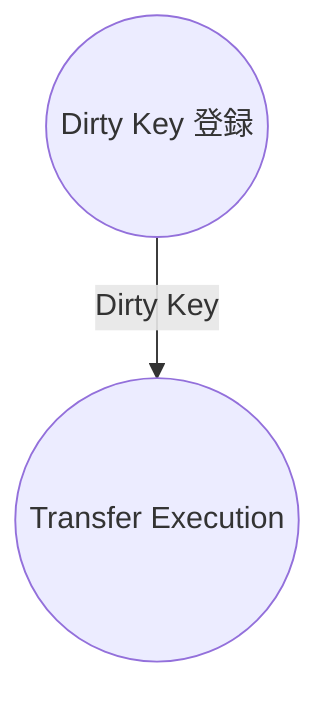
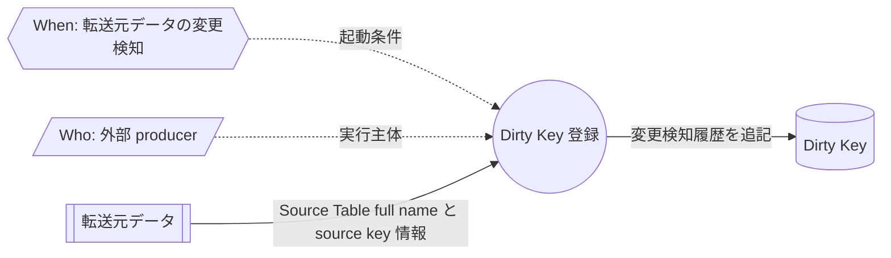
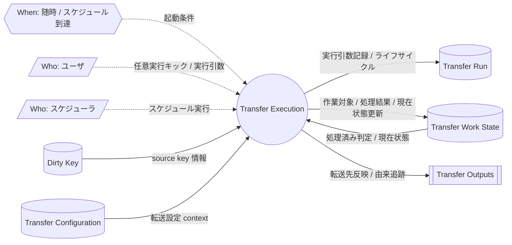

# Dirty Key Intake and Transfer Execution DFD

## Purpose

この文書は、`@rawsql-ts/transfer` の外部境界で Dirty Key がどのように流入し、Transfer Execution がそれをどの成果物へつなげるかを整理する Data Flow Diagram である。

Dirty Key の登録方法は transfer package の責務ではない。
ただし、Transfer Execution は Dirty Key を入力として利用するため、Dirty Key がどこから来るかを DFD 上で明示する。

この文書は Dirty Key の Concept Spec を再定義しない。
CDC、DB trigger、差分batch、手動登録、application event publishing などの具体方式も定義しない。

## Overall Flow

`Transfer Execution` は、既存の Transfer Execution Process Map で定義する転送プロセスを指す。

この overall flow は、業務相関だけを示す。
`Dirty Key 登録` の中身は detail flow で扱う。
`Transfer Execution` の処理順序は、Transfer Execution Process Map が定義する。
このDFDでは、Transfer Execution が読むデータと生み出すデータを整理する。

## Boundary

`@rawsql-ts/transfer` は、変更検知方式を定義しない。

Dirty Key は、CDC、DB trigger、差分batch、手動登録、application event publishing など、任意の external producer から登録されてよい。

この DFD で固定するのは、external producer が Dirty Key を登録し、Transfer Execution が後続処理で Dirty Key を参照する、というデータフローだけである。

## Dirty Key 登録

### Notes

- `Event / When` は、source data の変更が検知されたときである。
- `Role / Who` は外部 producer である。これは人間、ユーザー、外部システムなどの実行主体を表す。
- `Source Data` は transfer package の管理対象外にある外部データである。
- `External Producer` は transfer package の管理対象外である。
- `Dirty Key 登録` は業務プロセスであり、DFD上のプロセス定義対象である。
- Dirty Key には、Source Table full name と source key が登録される。
- Dirty Key は変更検知履歴であり、転送対象確定、転送判断、転送結果ではない。
- Dirty Key には、転送済み状態や処理済み状態を書き戻さない。

## Transfer Execution

### Notes

- `Transfer Execution` は、Dirty Key を直接転送するのではなく、Process Map で定義された `Prepare Work Item` を通して Work Item を作る。
- `Transfer Run` は、外部から積まれる queue や stack ではない。Transfer Execution が生成する、実行引数記録兼プロセスヘッダーである。
- 実行引数は Transfer Execution の入力条件である。ただし、DFD上では `Transfer Run` を入力ストレージとして扱わない。
- `Transfer Configuration` は、Transfer Setting、Destination Link、Destination をまとめたDFD用グループである。
- `Transfer Work State` は、Dirty Key Processing、Active Black、Work Item をまとめたDFD用グループである。
- `Transfer Outputs` は、Destination Table と Lineage をまとめたDFD用グループである。
- これらのグループはDFDを簡潔にするための説明ラベルであり、Process Mapでは具体的なConceptを使う。

## Review Points

- この DFD は、変更検知方式を transfer package の責務にしていないか。
- Dirty Key が「転送対象」や「転送指示」に見えていないか。
- External Producer の実装方式に依存する説明になっていないか。
- 後続の Transfer Execution が Dirty Key を入力として扱う境界が読み取れるか。
- Transfer Execution の実行引数と Transfer Run が混同されていないか。
- Transfer Execution の成果物が Process Map と Concept Spec の範囲から外れていないか。
