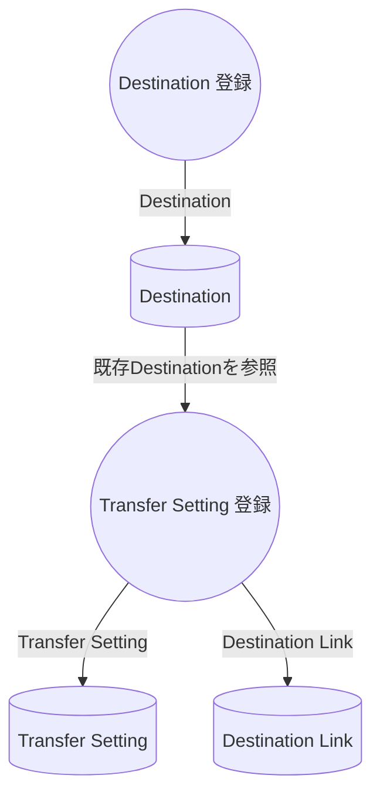
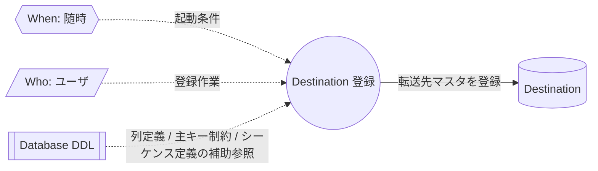
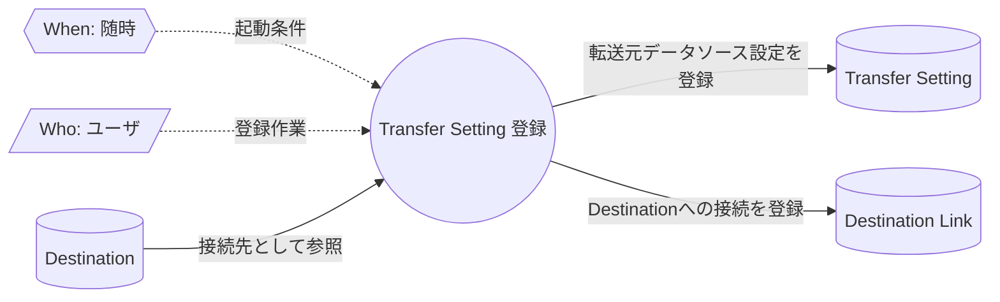

# Transfer Master Registration DFD

## Purpose

この文書は、`@rawsql-ts/transfer` における転送マスタ登録業務を整理する Data Flow Diagram である。

Destination 登録は、ユーザが転送先テーブルへ書き込むための転送先マスタを登録する業務である。

Transfer Setting 登録は、ユーザが既存の Destination を参照し、転送元データソースと Destination Link を登録する業務である。

このDFDでは、ユーザが必要に応じてデータベースDDLを参照し、Destination を作成する流れだけを扱う。
DDL参照は補助情報であり、Destination 登録の必須入力ではない。

## Overall Flow

この overall flow は、転送マスタ登録業務と生成されるマスタ概念の相関だけを示す。
登録画面、入力フォーム、DDLスキャン、自動補完などの実装方式は定義しない。

## Boundary

`@rawsql-ts/transfer` は、Destination 登録時にデータベースDDLを必須入力として要求しない。

データベースDDLは、転送先テーブル名、列定義、主キー制約、シーケンス定義などを確認するための補助情報である。
ユーザはDDLを参照してもよいし、必要な情報を手入力してもよい。

この業務は単純なマスタ登録であり、現時点では独立した Process Map を持たない。

## Destination 登録

### Notes

- `Event / When` は随時である。
- `Role / Who` はユーザである。
- `Database DDL` は補助参照であり、Destination 登録の必須入力ではない。
- `Destination 登録` は、転送先テーブルへ書き込むための Destination を作成する。
- このDFDは、Destination の Concept Spec を再定義しない。

## Transfer Setting 登録

### Notes

- `Event / When` は随時である。
- `Role / Who` はユーザである。
- `Destination` は既存の転送先マスタとして参照する。
- `Transfer Setting 登録` は、転送元データソースを表す Transfer Setting と、Destination への接続を表す Destination Link を作成する。
- この業務は単純なマスタ登録であり、現時点では独立した Process Map を持たない。
- このDFDは、Transfer Setting、Destination Link、Destination の Concept Spec を再定義しない。

## Review Points

- Database DDL が必須入力に見えていないか。
- Destination 登録がDDLスキャンや自動生成の実装方式に依存していないか。
- Destination の意味、責務、非責務をこのDFD内で再定義していないか。
- Transfer Setting 登録が、Destination そのものを再定義する業務に見えていないか。
- Destination Link が、Transfer Setting と Destination の接続として読めるか。
- 単純なマスタ登録を不要に Process Map 化していないか。
