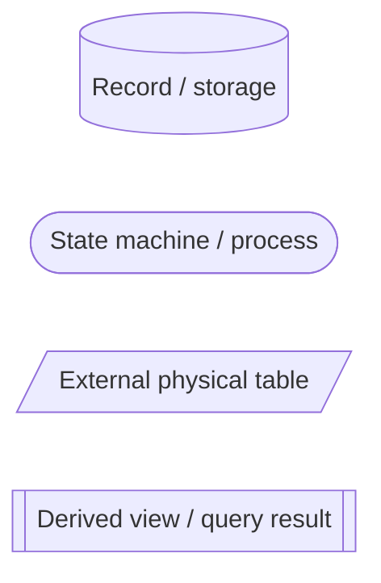
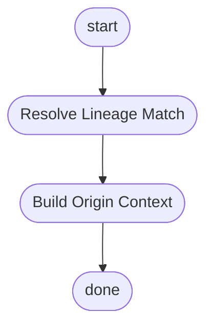
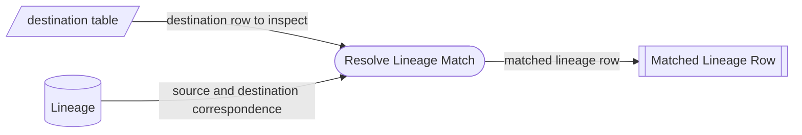
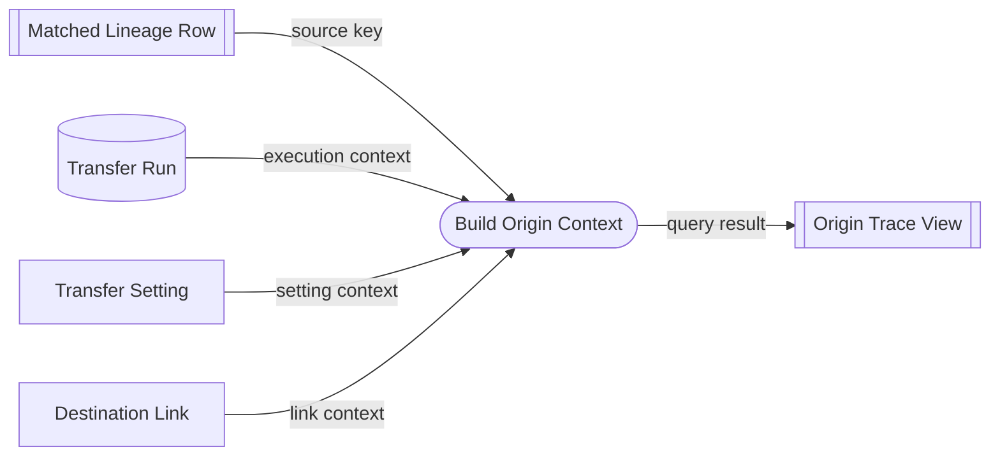
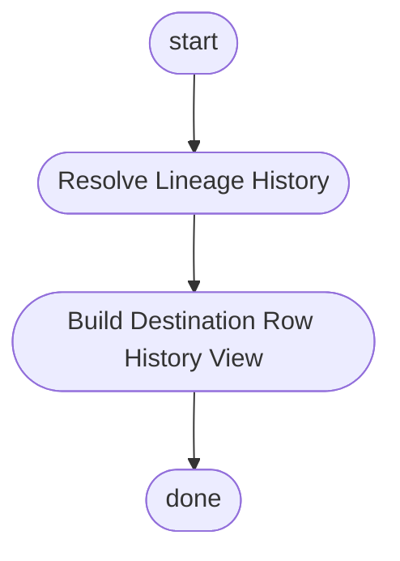
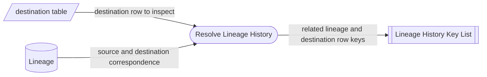
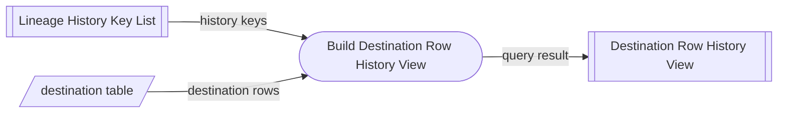

# Lineage Trace Process Map

## Purpose

この文書は、`@rawsql-ts/transfer` の監査、デバッグ、由来追跡のための `Lineage` 照会プロセスを整理する。

Concept Spec は概念の意味、責務、非責務、不変条件を定義する。
この文書は、`destination table` の行から `Lineage` を通じて元ネタ、実行文脈、宛先別文脈、関連履歴を確認する process map である。

この文書は Concept Spec 本文を再定義しない。
照会 SQL、画面、API、監査ログ実装は定義しない。

`Lineage` は `immutable transfer model` の転送時に存在する概念である。
この文書の trace 対象は、`Lineage` が存在する `destination table` の行に限る。
`mutable transfer model` の追跡は、`Lineage` ではなく処理ログ、監査ログ、または別の追跡概念で扱う。

## Diagram Legend

## Trace Origin From Destination Row flow

`Trace Origin From Destination Row` は、`destination table` の行を起点に、その行がどの元ネタから、どの実行文脈と宛先別文脈で作られたかを確認する。

主な用途は、転送先行を見た人が「この行はどうやってできたのか」を調べることである。

この process map では、読み取り専用の中間結果を `Derived view` として表す。
これは CTE や一時表の物理設計ではなく、照会結果を段階的に理解するための概念的な view である。

## Resolve Lineage Match detail

`Resolve Lineage Match` は、調査対象の `destination table` 行に対応する `Lineage` 1行を特定し、後続プロセスで参照できる `Matched Lineage Row` を作る。

## Build Origin Context detail

`Build Origin Context` は、`Matched Lineage Row` を起点に、元ネタ、実行文脈、転送設定、宛先別文脈を集めた `Origin Trace View` を作る。

## Trace Destination Row History flow

`Trace Destination Row History` は、`destination table` の行を起点に、同じ `source key` と `Destination Link` の文脈で作られた前後の `Lineage` を確認する。

主な用途は、その行が現在有効な行なのか、過去にどのような変更履歴があり、この後にどのような変更が起きたのかを調べることである。

## Resolve Lineage History detail

`Resolve Lineage History` は、調査対象の `destination table` 行に対応する `Lineage` を特定し、その `Lineage` と同じ `source key` と `Destination Link` の文脈にある履歴 N 行のキーを特定する。

`Trace Origin From Destination Row` が調査対象行に対応する `Lineage` 1行を取得するのに対し、このプロセスは履歴照会のために関連する `Lineage` N 行を取得する。

## Build Destination Row History View detail

`Build Destination Row History View` は、`Lineage History Key List` と `destination table` を使って、履歴照会結果として `Destination Row History View` を作る。

