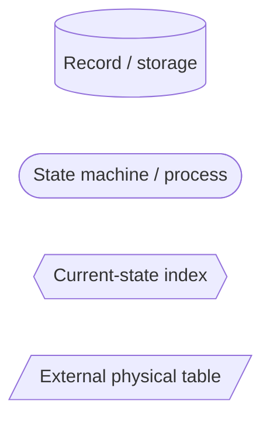
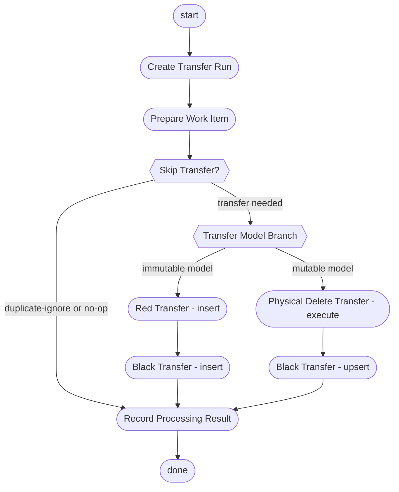
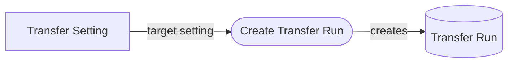
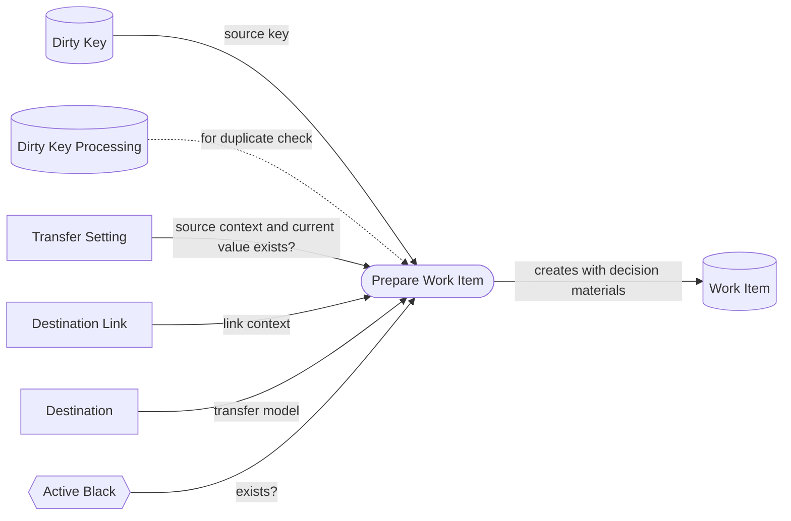
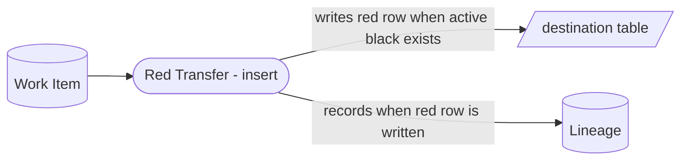
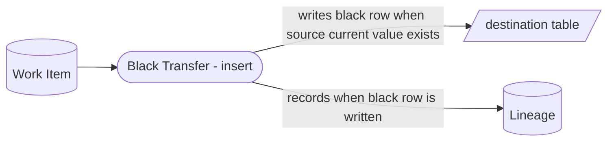
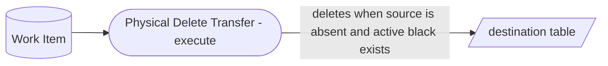
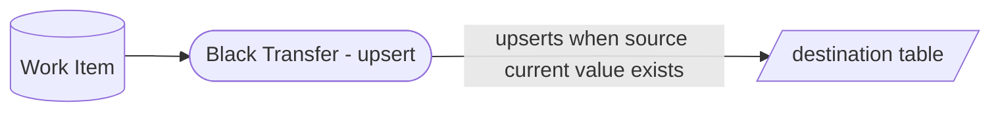
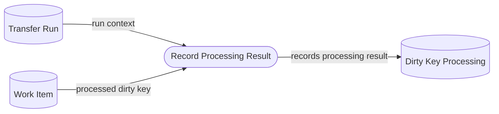

# Transfer Execution Process Map

## Purpose

この文書は、`@rawsql-ts/transfer` の転送プロセスを整理する。

Concept Spec は概念の意味、責務、非責務、不変条件を定義する。
この文書は、それらの Concept を使って `Transfer Execution` がどの順序で処理を進めるかを示す process map である。

この文書は Concept Spec 本文を再定義しない。
処理の詳細な SQL、DDL、API、トランザクション実装は定義しない。

## Process Map Rules

Mermaid diagrams in this document are Step Functions-like process maps.

Main routine diagrams have explicit `start` and `done` nodes.
Detail diagrams explain one process only.
Detail diagrams use `flowchart LR` because they describe input, process, and output.

When a diagram describes movement, fixation, transfer, tracing, or result recording, route the relationship through an operation/routine node.
Diagram arrows should not imply that data moves directly from one stored concept to another.

`Prepare Work Item` owns transfer-decision preparation.
A `Work Item` carries the decision materials, not a duplicated transfer-operation enum.
The main routine first decides whether transfer operations should be skipped.
If transfer operations are needed, the transfer model selects either the immutable route or the mutable route.
Inside each route, transfer operations run in the route order and have a destination-side effect only when the `Work Item` materials satisfy that operation.
If no transfer operation has a destination-side effect, the processing result is still recorded by `Record Processing Result`.
The `Prepare Work Item detail` view shows the concept references needed to make that route decision possible in principle.
If `Work Item` does not carry enough decision material, this process map does not hold.

The main routine represents batch transfer conceptually.
Branch nodes show how prepared `Work Item` records are classified inside the batch; they do not mean the transfer execution is limited to a single row.

## Diagram Legend



## Transfer Execution Main



## Create Transfer Run detail



## Prepare Work Item detail



## Red Transfer - insert detail



## Black Transfer - insert detail



## Physical Delete Transfer - execute detail



## Black Transfer - upsert detail



## Record Processing Result detail



## Active Black Example

Active Black は、Red Transfer する場合にどの黒伝を符号反転対象にするかを示す。

```text
black 1: +100
```

この場合、`1` が active。

```text
black 1: +100
red 2: -100
```

この場合、active はない。

```text
black 1: +100
red 2: -100
black 3: +150
```

この場合、`3` が active。

この例はプロセス理解のための説明であり、Active Black の Concept Spec 本文ではない。
