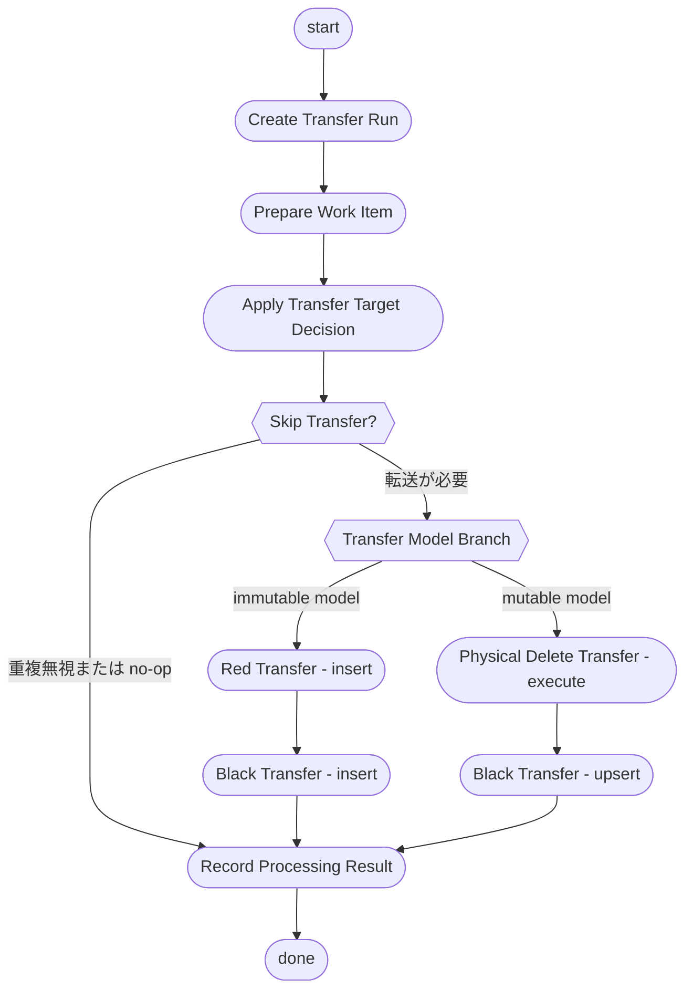
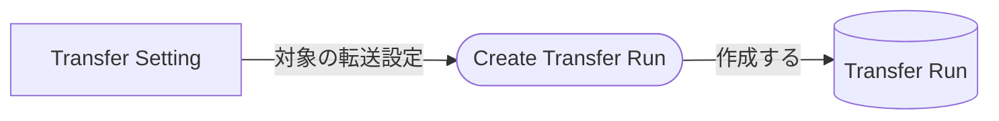
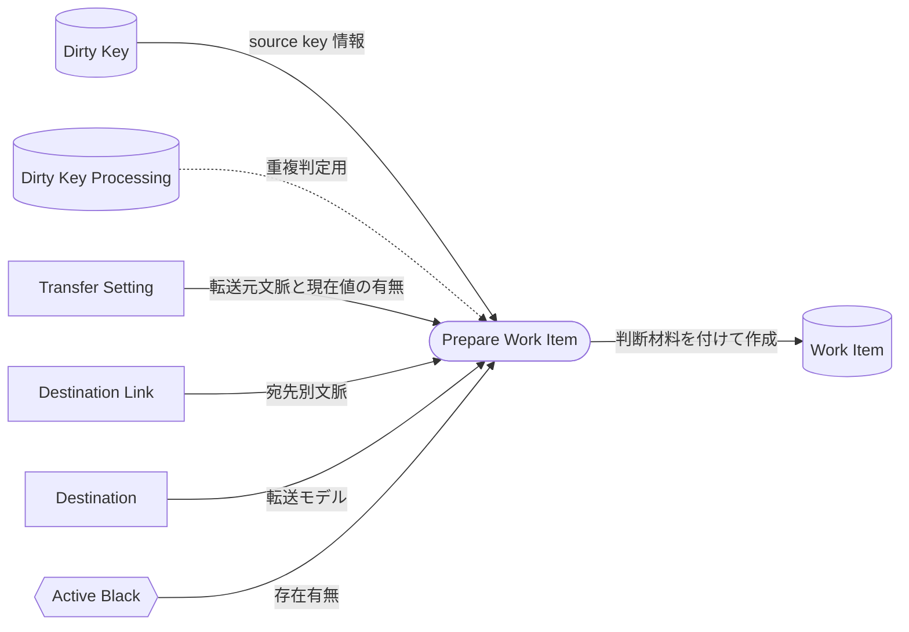
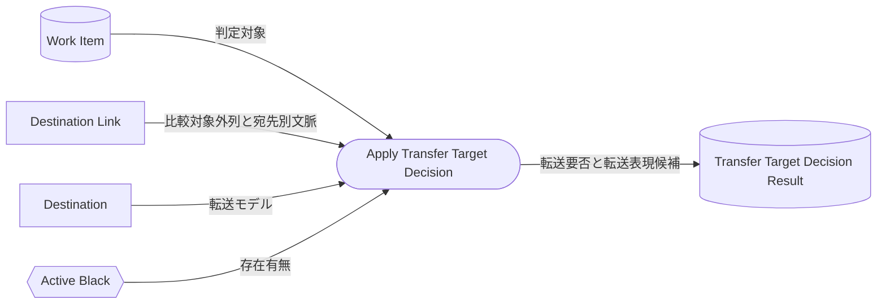
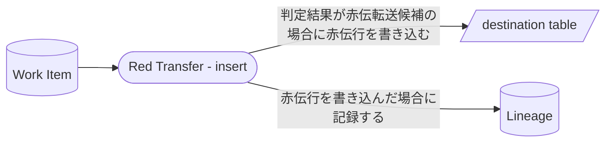
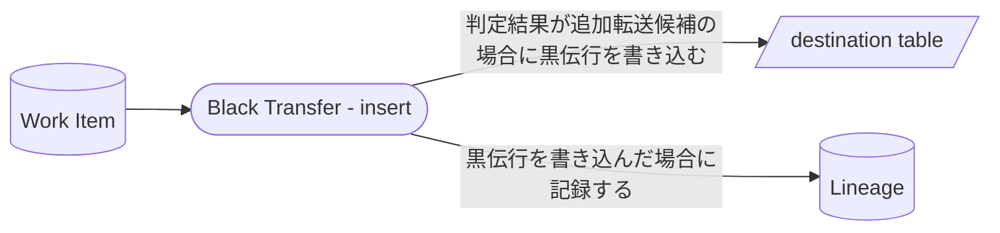
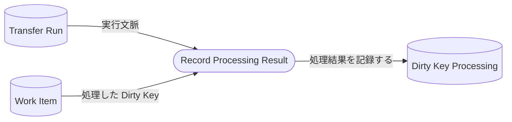

# Transfer Execution Process Map

## Purpose

この文書は、`@rawsql-ts/transfer` の転送プロセスを整理する。

Concept Spec は概念の意味、責務、非責務、不変条件を定義する。
この文書は、それらの Concept を使って `Transfer Execution` がどの順序で処理を進めるかを示す process map である。

この文書は Concept Spec 本文を再定義しない。
処理の詳細な SQL、DDL、API、トランザクション実装は定義しない。

## Process Map Rule Reference

This document follows the shared [Process Map Rules](/guide/concept-spec-overview#process-map-rules).
<!-- rule-source: concept-spec-overview.md#process-map-rules -->

## Diagram Legend


## Transfer Execution Main



## Create Transfer Run detail



## Prepare Work Item detail



## Apply Transfer Target Decision detail



## Red Transfer - insert detail



## Black Transfer - insert detail



## Physical Delete Transfer - execute detail


## Black Transfer - upsert detail


## Record Processing Result detail



## Active Black Example

Active Black は、Red Transfer する場合にどの黒伝を符号反転対象にするかを示す。

```text
black 1: +100
```

この場合、`1` が active。

```text
black 1: +100
red 2: -100
```

この場合、active はない。

```text
black 1: +100
red 2: -100
black 3: +150
```

この場合、`3` が active。

この例はプロセス理解のための説明であり、Active Black の Concept Spec 本文ではない。
